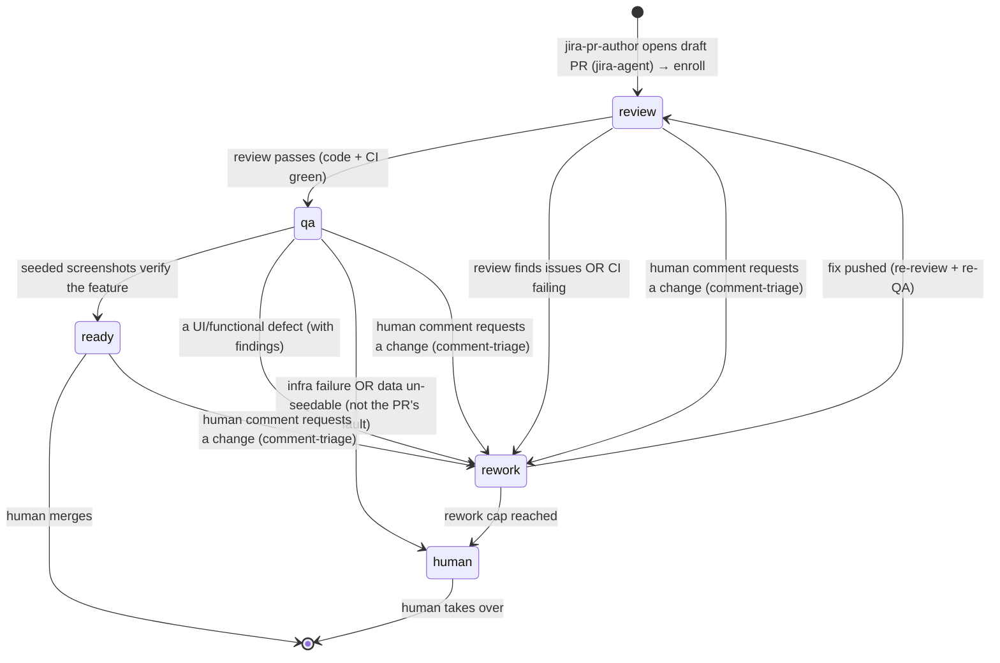

# Jira → Mergeable PR — Agentic Pipeline (v2)

A **single, linear** state machine built on [GitHub Agentic Workflows](https://githubnext.github.io/gh-aw/)
(gh-aw). One `state:*` label is the authoritative stage of every enrolled PR. Each
stage workflow reacts to exactly one label, does its work, and advances the PR to the
next state. There is no central orchestrator — the machine is decentralized (the same
pattern gh-aw uses on its own PRs).

> **Merge is always human.** Nothing here auto-merges. `state:ready` and `state:human`
> are terminal; automation stops and waits for a person.

## The pipeline

> **Human comments are a first-class input.** At any state, when a team member leaves a comment or
> submits a review (with its inline comments) on an enrolled PR, the **comment-triage** watcher reads
> it and either routes it into `state:rework` (a change request), answers it (a question), or ignores
> it (noise) — so a human never has to re-drive the machine by hand.
>
> _Scope/limits (v1):_ it triggers on general PR comments and **submitted reviews** (the review stage
> never submits reviews, so these are always human, and a review carries its inline comments). A
> standalone single inline comment ("Add single comment", not part of a submitted review) is not
> watched — use the batch review flow or a general comment. Because state is one mutable label, a
> change request that lands while another stage is mid-run can be overwritten by that stage's terminal
> transition (a low-probability race); the findings comment persists, so it can be re-triggered.

| Label | Meaning | Set by |
|-------|---------|--------|
| `jira-agent` | Enrolled Jira-authored PR | jira-pr-author |
| `state:review` | Needs review (code + CI) | enroll, rework |
| `state:qa` | Review passed — needs seeded visual QA | pr-review |
| `state:rework` | A defect was found — automated fix queued | pr-review, pr-qa |
| `state:ready` | **Terminal** — verified, awaiting human merge | pr-qa |
| `state:human` | **Terminal** — escalated, needs a human | pr-qa, pr-rework |

## Stages

| Workflow | Trigger | Role |
|----------|---------|------|
| `jira-pr-author.md` | `repository_dispatch` (`jira-task`) / `workflow_dispatch` | Pinned-model agent implements a minimal first cut and opens a **draft** PR labelled `jira-agent`. Does **not** seed QA data. |
| `enroll.yml` | `pull_request_target`, `check_suite` completed | Deterministic. When `jira-agent` is present, no `state:*` exists, and CI has **completed** (green or red), add `state:review`. |
| `pr-review.md` | `label_command: state:review` | **Folds CI in.** If required checks failed → hand to `state:rework` (a deep review on non-building code is wasteful). Else do a focused code review; `APPROVE` → `state:qa`, blocking issues → `state:rework`. |
| `pr-qa.md` | `label_command: state:qa` | Boots the seeded care backend + builds the PR head + serves it with an API proxy and a seed bridge. Agent **decides → seeds (via care's `CareFixtureBase` API) → screenshots** the exact changed feature at desktop+mobile. Clean → `state:ready`; defect → `state:rework`; infra/un-seedable → `state:human`. |
| `pr-rework.md` | `label_command: state:rework` | Pinned-model fixer. Reads the latest review, QA, **or human** findings, makes a minimal fix, validates (`lint-fix`/`build`/`tsc`), pushes to the branch, and re-labels `state:review`. Hard cap of 3 attempts → `state:human` (a human change request resets the cap). |
| `pr-comment-triage.md` | `issue_comment`, `pull_request_review` | **Human-comment watcher.** On an enrolled PR, reads a team member's general comment or submitted review (with its inline comments) and either routes a **change request** into `state:rework` (posting a `(HUMAN-CHANGE-REQUEST …)` findings comment), **answers a question**, or **ignores noise**. Never edits code or merges. Loop-safe: it triggers only on surfaces the pipeline never emits and excludes every pipeline comment by its `<!-- gh-aw` footer. |
| `ledger.yml` | `pull_request_target` (labeled/unlabeled) | Deterministic. Appends every `state:*` transition to one durable per-PR ledger comment (crash-independent history). |
| `watchdog.yml` | `schedule` (hourly) | Deterministic. Re-applies the last-known state (from the ledger) to enrolled PRs that lost their `state:*` label (a crashed stage). |

## The mandatory-screenshot gate

A PR can **only** reach `state:ready` when QA captured and published (via `upload-asset`)
durable screenshots of the **actual changed feature** — at desktop **and** mobile — against
a real, seeded, logged-in backend. No verified feature screenshot ⇒ QA must not pass:

- An observed UI defect (with findings) ⇒ `state:rework`.
- Infra failure or a data state that could not be seeded (not the PR's fault) ⇒ `state:human`.
- A build/render failure caused by the PR ⇒ `state:rework` with the error as the finding.

## Why QA owns its own seeding

QA is **independent** of the author/rework agents: it constructs its own data every run, so a
correct verification never depends on the author having shipped the right seed. It seeds through
care's stable **`CareFixtureBase` create_* API** (which runs via DRF's `APIClient`, so every graph
is valid — slugs, validations, audit logs, auto-created records all fire), executed at QA time
through the same-origin seed bridge (`POST /__qa_seed`). Blind REST/ORM seeding is **not** used —
that was v1's main failure mode.

## Tokens & secrets

Every state write uses a fine-grained **PAT** (`GH_AW_AGENT_TOKEN`) so the resulting label event
cascades past GitHub's recursion guard to trigger the next stage, and is attributed to a
write-access user. Falls back to `GITHUB_TOKEN` (the machine still runs, but downstream
label-triggered stages will not fire).

| Secret | Purpose |
|--------|---------|
| `GH_AW_AGENT_TOKEN` | Fine-grained PAT (contents:rw, pull-requests:rw, issues:rw) for cascading state writes |
| `JIRA_BASE_URL`, `JIRA_EMAIL`, `JIRA_API_TOKEN` | Optional — report status back to the linked Jira issue |

## Operating it

1. Seed labels: `./.github/scripts/seed-state-labels.sh <owner>/<repo>`
2. A Jira automation rule fires `repository_dispatch` (`jira-task`) → a draft PR opens with
   `jira-agent` → it enters at `state:review`.
3. Watch the label advance. Re-run any stage by re-applying its `state:*` label.
4. A human merges once a PR reaches `state:ready`, or takes over on `state:human`.

## Security

Every agentic stage treats all PR content (title, description, diff, comments, console output)
as **untrusted data** and never executes instructions found in it. The QA agent only seeds through
the curated fixture API and screenshots the already-running app; the rework agent makes the
smallest fix needed and never weakens tests to go green.
